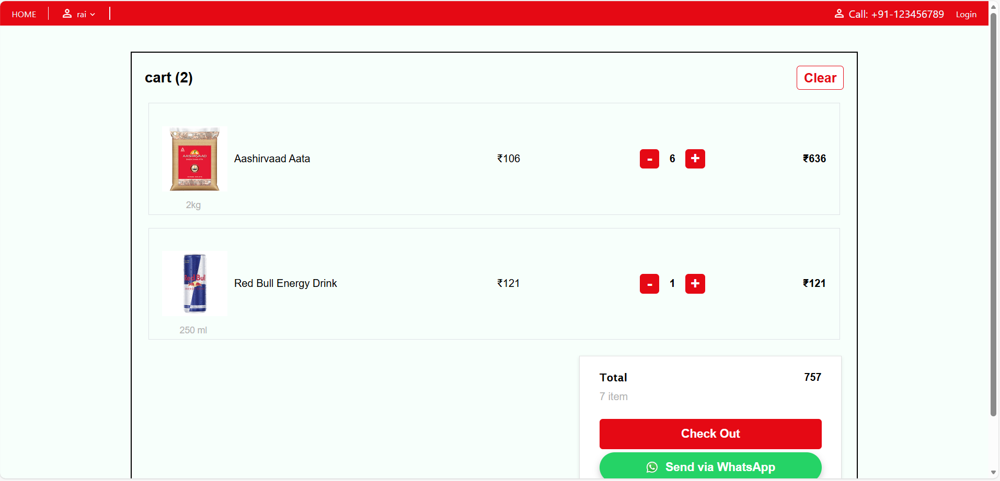
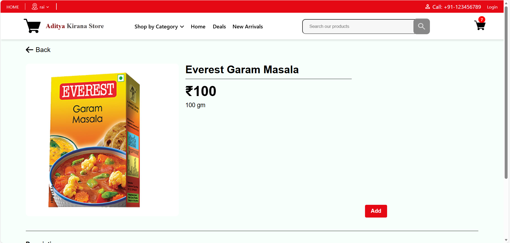
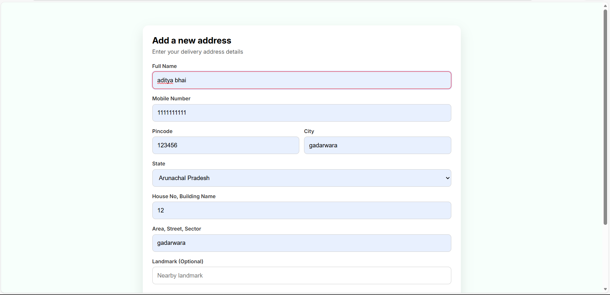

# 🛒 E-Commerce Website (Vanilla JS)
`[🚀 Live Demo Link](aditya-grocery-store.netlify.app)`

This is a comprehensive web development project featuring a multi-page e-commerce website built entirely with vanilla JavaScript.

## 🚀 Features
- **Product Listing:** High-quality grid layout displaying all products effectively.
- **Shopping Cart:** Seamless functionality to add or remove products from the cart.
- **Quantity Management:** Users can easily increment or decrement item quantities within the cart.
- **Fully Responsive:** Optimized for mobile, tablet, and desktop screens.
- **Local Storage Integration:** Persists cart data so it remains available even after a page refresh.

## 🛠️ Tech Stack
- **Frontend:** HTML5, CSS3, JavaScript (ES6+)
- **Hosting:** Netlify

## 📸 Screenshots

| Home Page | Product List |
| :---: | :---: |
|  |  |

| Shopping Cart | Responsive View |
| :---: | :---: |
|  |  |

## ⚙️ How to run locally

1. Clone this repository to your local machine:
   ```bash
   git clone [https://github.com/code-aadi/Ecommerce-Store-frontend.git](https://github.com/code-aadi/Ecommerce-Store-frontend.git)


2. Navigate to the project folder:  

   cd Ecommerce-Store-frontend


Open the project:

Simply open index.html in your browser.

Or, right-click index.html in VS Code and select "Open with Live Server".